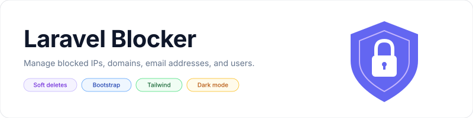

<p align="center">
    <picture>
        <source media="(prefers-color-scheme: dark)" srcset="art/banner-dark.svg">
        <source media="(prefers-color-scheme: light)" srcset="art/banner-light.svg">
        
    </picture>
</p>

<p align="center">Block IP addresses, email addresses, domains, users, and locations in Laravel.</p>

<p align="center">
    <a href="https://packagist.org/packages/jeremykenedy/laravel-blocker"></a>
    <a href="https://packagist.org/packages/jeremykenedy/laravel-blocker"></a>
    <a href="https://github.com/jeremykenedy/laravel-blocker/actions/workflows/tests.yml"></a>
    <a href="https://github.styleci.io/repos/171390607"></a>
    <a href="LICENSE"></a>
</p>

## Table of Contents

- [Framework Support](#framework-support)
- [Requirements](#requirements)
- [Installation](#installation)
- [Quick Start](#quick-start)
- [Features](#features)
- [Screenshots](#screenshots)
- [Configuration](#configuration)
- [Changing Frameworks](#changing-frameworks)
- [Artisan Commands](#artisan-commands)
- [Middleware and Authorization](#middleware-and-authorization)
- [Optional Packages](#optional-packages)
- [Updating](#updating)
- [Testing](#testing)
- [License](#license)

## Framework Support

The package supplies Blade views. Bootstrap 4 remains the default, and Bootstrap 3 configuration is still honored. Composer updates do not change frameworks, publish files, or run migrations.

| CSS framework | Views | Assets supplied by your layout |
| --- | --- | --- |
| Bootstrap 4 (default) | Existing Blade views | Bootstrap 4 and jQuery |
| Bootstrap 3 | Existing Blade views | Bootstrap 3 and jQuery |
| Bootstrap 5 | Modern Blade views | Bootstrap 5 CSS |
| Tailwind CSS | Modern Blade views | Your compiled Tailwind CSS |

Modern views use native forms and JavaScript. The package serves its own CSS and JavaScript through the named `laravelblocker::assets` route; no asset publishing step is required. Theme styles affect only the Blocker interface.

## Requirements

The package retains PHP `^7.3|^8.0` and its existing runtime dependency ranges. The compatibility suite covers Laravel 5.8 through 13 with matching PHP versions. Compatibility with historical releases does not extend their security support period. Laravel 5.7 and earlier applications should keep their existing release, such as `v1.0.6`.

[spatie/laravel-html](https://github.com/spatie/laravel-html) and [eklundkristoffer/seedster](https://github.com/eklundkristoffer/seedster) remain dependencies for existing forms and seed registration. The packages listed under [Optional Packages](#optional-packages) are not required.

## Installation

```sh
composer require jeremykenedy/laravel-blocker
php artisan blocker:install
```

The installer asks which CSS framework to use and saves presentation settings to `config/laravelblocker-ui.php`. It detects and preserves existing main configuration files and views. Views run from the package unless you publish copies for customization.

For an unattended installation, retain the configured framework or the Bootstrap 4 default:

```sh
php artisan blocker:install --no-interaction
```

Before migrating, set your database connection and user model. The defaults remain `mysql` and `App\User`. A newer application will usually need:

```dotenv
LARAVEL_BLOCKER_DATABASE_CONNECTION=mysql
LARAVEL_BLOCKER_USER_MODEL="App\Models\User"
```

The `users` table must exist on the blocker connection before the package migration runs. Its existing foreign keys reference that table. Migrations load automatically.

```sh
php artisan migrate
php artisan db:seed --class='jeremykenedy\LaravelBlocker\Database\Seeders\DefaultBlockedTypeTableSeeder'
```

To add the existing sample blocked domains, run the item seeder separately:

```sh
php artisan db:seed --class='jeremykenedy\LaravelBlocker\Database\Seeders\DefaultBlockedItemsTableSeeder'
```

These include `example.com`, `test.com`, and `mailinator.com`. Run this seeder only if you want those domains blocked. Existing Seedster registration flags remain available; Composer updates never execute seeders.

## Quick Start

Open `/blocker` to manage active entries and `/blocker-deleted` to restore or permanently delete entries. All framework choices use the same routes and forms.

For the existing Bootstrap 3 or 4 Blade views, use distinct CSS and script sections in your layout:

```dotenv
LARAVEL_BLOCKER_BLADE_PLACEMENT_CSS=blocker_css
LARAVEL_BLOCKER_BLADE_PLACEMENT_JS=blocker_js
LARAVEL_BLOCKER_JQUERY_CDN_ENABLED=false
```

```blade
<head>
    @yield('blocker_css')
</head>
<body>
    @yield('content')
    @yield('blocker_js')
</body>
```

Load your CSS in the head and load jQuery and Bootstrap before the `blocker_js` section. This avoids loading jQuery twice. The original section names and CDN switches remain supported.

For Bootstrap 5 Blade views:

```sh
php artisan blocker:update --framework=bootstrap5 --theme=system
```

Load Bootstrap 5 CSS in `layouts.app` and keep its `@yield('content')` section. The modern views handle their own scripts.

For Tailwind Blade views:

```sh
php artisan blocker:update --framework=tailwind --theme=system
```

For Tailwind 4, add these sources to your application's CSS, adjusting paths relative to that file:

```css
@source "../../vendor/jeremykenedy/laravel-blocker/src/resources/views/modern";
@source "../views/vendor/laravelblocker/modern";
```

For Tailwind 3, include those view paths in `content` in `tailwind.config.js`. Run `npm run build` after changing the application's assets or CSS sources.

## Features

- Blocking by IP, email, domain, user email, city, state, country, continent, and region.
- Creation, editing, search, soft deletion, restoration, and permanent deletion.
- Optional server pagination and legacy DataTables support.
- Bootstrap 3/4 compatibility with separate Bootstrap 5 and Tailwind views.
- Light, dark, and system themes, with a persistent appearance selector in modern views.
- Configurable authentication, role middleware, database connection, user model, and blocked response.
- Setup commands that preserve existing files and back up views before explicit replacement.

## Screenshots

The original Bootstrap interface is shown below, including search, forms, deletion, and restoration. Bootstrap 4 remains the default. Bootstrap 5 and Tailwind use the separate modern views described above.


## Configuration

Existing keys, environment variables, routes, model namespaces, facade binding, and publish tags remain available. See the [complete configuration](src/config/laravelblocker.php).

| Setting | Environment variable | Default |
| --- | --- | --- |
| `frontend` | `LARAVEL_BLOCKER_FRONTEND` | `legacy` |
| `theme` | `LARAVEL_BLOCKER_THEME` | `light` |
| `blockerBootstapVersion` | `LARAVEL_BLOCKER_BOOTSTRAP_VERSION` | `4` |
| `laravelBlockerBladeExtended` | `LARAVEL_BLOCKER_BLADE_EXTENDED` | `layouts.app` |
| `blockerDatabaseConnection` | `LARAVEL_BLOCKER_DATABASE_CONNECTION` | `mysql` |
| `defaultUserModel` | `LARAVEL_BLOCKER_USER_MODEL` | `App\User` |
| `blockerPaginationEnabled` | `LARAVEL_BLOCKER_PAGINATION_ENABLED` | `false` |
| `blockerPaginationPerPage` | `LARAVEL_BLOCKER_PAGINATION_PER_PAGE` | `25` |
| `geolocationUrl` | `LARAVEL_BLOCKER_GEOLOCATION_URL` | Existing GeoPlugin JSON endpoint |
| `geolocationTimeout` | `LARAVEL_BLOCKER_GEOLOCATION_TIMEOUT` | `2` seconds |

`frontend` accepts `legacy`, `bootstrap5`, or `tailwind`. Legacy views use the existing `blockerBootstapVersion` key, including its historical spelling. Themes accept `light`, `dark`, or `system`. Modern views save a visitor's appearance choice in local storage; the selector also works when storage is unavailable. Legacy views use the configured theme.

The setup commands save `frontend`, `theme`, and `blockerBootstapVersion` in `config/laravelblocker-ui.php`. That profile takes precedence over the same main config/environment settings. Remove the profile to return to environment-managed presentation settings. Commands clear configuration and compiled-view caches; rebuild your config cache during deployment if needed.

Location lookup retains the existing GeoPlugin URL. GeoPlugin now requires a paid plan, and its [HTTPS endpoint](https://www.geoplugin.com/webservices/ssl) uses an account key. Configure a working JSON URL, including credentials if required. Blocker appends the request IP and expects the existing `geoplugin_*` fields. An unavailable or invalid response supplies no location data; IP and email checks continue.

## Changing Frameworks

Use the update command for interactive framework selection:

```sh
php artisan blocker:update
```

For a quick change, pass the selection directly to the same command:

```sh
php artisan blocker:update --framework=bootstrap5 --theme=system
php artisan blocker:update --framework=tailwind --theme=dark
php artisan blocker:update --framework=bootstrap4 --theme=light
```

| Option | Values | Effect |
| --- | --- | --- |
| `--framework=` | `bootstrap3`, `bootstrap4`, `bootstrap5`, `tailwind` | Select the Blade view family and CSS framework |
| `--theme=` | `light`, `dark`, `system` | Set the default appearance |
| `--no-interaction` | Flag | Use supplied or existing settings without prompts |

Existing application configuration and view overrides are preserved. Modern views use `laravelblocker::modern`; legacy views retain `laravelblocker::laravelblocker`. Switching back restores use of your published legacy templates. Run `npm run build` after changing the host application's framework assets.

## Artisan Commands

| Command | Description | Options |
| --- | --- | --- |
| `blocker:install` | Configure Blocker and publish missing main configuration | `--framework`, `--theme`, `--views`, `--force`, `--ui-kit`, `--no-interaction` |
| `blocker:update` | Change presentation settings or refresh published views | Same options as install |

| Install/update option | Description |
| --- | --- |
| `--framework=` | Bootstrap 3, 4, 5, or Tailwind; values listed above |
| `--theme=` | Light, dark, or system appearance |
| `--views` | Publish missing views for customization |
| `--force` | With `--views`, back up and replace existing published views |
| `--ui-kit` | Run the installed optional UI Kit installer using the selected CSS framework and Blade |
| `--no-interaction` | Skip interactive selection |

Backups are written to `storage/app/laravelblocker-backups`, outside Laravel's view discovery paths. Main configuration, translations, migrations, and seeders are not overwritten. Setup commands do not migrate, seed, edit `.env`, or install Composer dependencies.

Existing publish tags still work with `php artisan vendor:publish --tag=...`:

| Tag | Files |
| --- | --- |
| `laravelblocker-config` | Main configuration |
| `laravelblocker-views` | Blade templates |
| `laravelblocker-lang` | Translations |
| `laravelblocker-migrations` | Existing database migrations |
| `laravelblocker-seeders` | Customizable seeders |

## Middleware and Authorization

```php
Route::middleware(['web', 'checkblocked'])->group(function () {
    Route::get('/account', [AccountController::class, 'show']);
});
```

Authentication is enabled on management routes by default. Restrict access to administrators with your application's role middleware:

```dotenv
LARAVEL_BLOCKER_AUTH_ENABLED=true
LARAVEL_BLOCKER_ROLES_ENABLED=true
LARAVEL_BLOCKER_ROLES_MIDDLWARE=role:admin
```

The historical `rolesMiddlware` spelling is retained. Without role middleware enabled, any authenticated user can manage entries, as in existing releases.

Blocking checks the request IP, available location details, and the authenticated user's email and domain. It also checks email and domain on POST requests to the `register` route URI. Deleted rules are ignored. Changes take effect on subsequent requests, including long-running workers.

Choose `abort`, `view`, or `redirect` through `blockerDefaultAction` and its related settings. Registration blocks redirect back with an error. Configure trusted proxies in the host application so Laravel resolves client IP addresses correctly.

## Optional Packages

[Laravel UI Kit](https://github.com/jeremykenedy/laravel-ui-kit) can be set up explicitly alongside Blocker:

```sh
composer require jeremykenedy/laravel-ui-kit
php artisan blocker:install --framework=bootstrap5 --ui-kit
```

This calls the installed `ui-kit:install` command with the selected CSS framework and Blade frontend. UI Kit's own installation checks still apply. It supports Bootstrap 4, Bootstrap 5, and Tailwind. Blocker's views work independently and are not replaced with UI Kit components.

[Laravel Toast](https://github.com/jeremykenedy/laravel-toast), [Laravel Darkmode Toggle](https://github.com/jeremykenedy/laravel-darkmode-toggle), [Laravel IP Capture](https://github.com/jeremykenedy/laravel-ip-capture), and [Laravel Seedster](https://github.com/jeremykenedy/laravel-seedster) can be installed and configured independently in the host application. None is installed or invoked automatically. Built-in themes and flash messages need no additional package. The optional Laravel Seedster package does not replace `eklundkristoffer/seedster`.

## Updating

```sh
composer update jeremykenedy/laravel-blocker --with-dependencies
```

Published templates remain under your control. Compare customized copies with the package versions to receive fixes. Read the [upgrade guide](docs/upgrading.md) before replacing views, and see [CHANGELOG.md](CHANGELOG.md) for changes.

## Testing

```sh
composer install
composer test
BLOCKER_PLAIN_CONTROLLER=1 composer test
composer lint
composer install --working-dir=tools
tools/vendor/bin/pint --test
```

GitHub Actions tests Laravel 5.8 through 13 with matching PHP versions. Browser tests cover Bootstrap 3, 4, 5, and Tailwind. See the [testing guide](docs/testing.md) for browser setup, compatibility coverage, and known limits.

## License

This package is open-sourced software licensed under the [MIT license](LICENSE).
